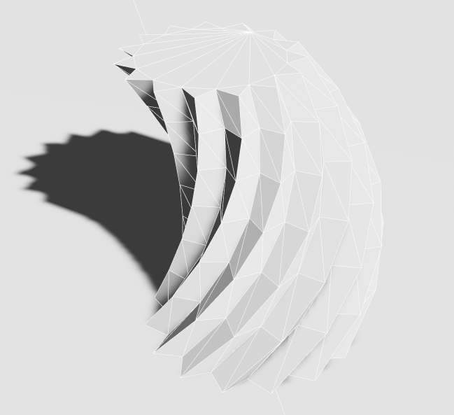

# Procedural Modelling

[](https://docs.rs/procedural_modelling)
[](https://crates.io/crates/procedural_modelling)
[](https://crates.io/crates/procedural_modelling)
[](https://bevyengine.org/learn/quick-start/plugin-development/#licensing)
[](https://github.com/bevy-procedural/modelling/actions)
[](https://github.com/bevy-procedural/modelling)

A Framework-Agnostic Procedural Modelling Library.

Uses a datastructure based on half-edge meshes to represent (open) manifold meshes with optional non-manifold vertices. Our goal is to implement operations like Boolean Operations, Subdivisions, Curved Surfaces, and Stitching. The library aims to support the tesselation of 2d surfaces in a modular way that can be used without any of the 3d features.

Currently there are quite a few crates that implement boolean operations and tesselation to achieve some other goal. We want to provide a common implementation to satisfy these very similar requirements and improve code-reuse among these projects so they can focus on their original goal.

## WARNING

This crate is still in a _very_ early stage of development. Expect frequent API modifications, bugs, and missing features. Feel free to contribute by opening issues, pull requests or sharing your ideas in [Github Discussion](https://github.com/bevy-procedural/modelling/discussions).

## Usage



Install using `cargo add procedural_modelling`.

```rs
let mut mesh = MeshVec3::regular_star(1.0, 0.8, 30);
mesh.transform(
    &Transform::from_translation(Vec3::new(0.0, -0.99, 0.0))
               .with_rotation(Quat::from_rotation_z(PI)),
);
let trans = Transform::from_rotation(Quat::from_rotation_y(0.3))
                      .with_translation(Vec3::new(0.4, 0.3, 0.0));
let mut f = mesh.extrude_ex(mesh.edge_between(1, 0).unwrap().id(), trans, true, true);
for _ in 0..5 {
    f = mesh.extrude_face_ex(f, trans, true, true);
}
mesh.to_bevy(RenderAssetUsages::default())
```

## Examples

<!--
Try the live examples!
 * [2d](https://bevy-procedural.org/examples/modelling/2d)
 * [3d](https://bevy-procedural.org/examples/modelling/3d)
-->

Or run the [examples](https://github.com/bevy-procedural/modelling/tree/main/examples) on your computer like, e.g., `cargo run --features="bevy bevy/bevy_pbr" --profile fast-dev --example box`.

For package development, we recommend using the `editor`-subcrate. This example has a little [egui](https://github.com/jakobhellermann/bevy-inspector-egui/)-editor. Run it using `cargo watch -w editor/src -w src -x "run -p editor --profile fast-dev"`. The `fast-dev` profile will enable optimizations for the dependencies, but not for the package itself. This will slow down the first build _significantly_, but incremental builds are slightly faster and bevy's performance (bevy is used as the renderer in the examples) improves a lot.

When developing tests, we recommend `cargo watch -w editor/src -w src -x "test --profile fast-dev --features sweep_debug_print"`.

## Feature Progress

-   Attributes
    -   [x] Positions
    -   [x] Normals
    -   [ ] Crease Weights
    -   [ ] Smooth Surface Groups
    -   [ ] Tangents
    -   [ ] UV Coordinates
    -   [ ] Custom Attributes
-   Triangulation
    -   [x] Montone Sweep-Line
    -   [x] Constrained Delaunay (using [Spade](https://github.com/Stoeoef/spade))
    -   [ ] Steiner Points
-   Primitives
    -   [x] Polygon, Star
    -   [x] Cuboid
    -   [x] Cylinder, Cone, Frustum, Tetrahedron, Octahedron
    -   [ ] Dodecahedron, Icosahedron
    -   [ ] UV Sphere
    -   [ ] Cube Sphere
    -   [ ] Icosphere
    -   [ ] Torus
-   Builder Primitives
    -   [x] Lines
    -   [ ] Quadratic Bezier Curves
    -   [ ] Cubic Bezier Curves
    -   [ ] Curved Surfaces (Bezier Surfaces / Parametric Surfaces / NURBS / Spline Networks...?)
-   Operations
    -   [x] Extrude
    -   [ ] Loft
    -   [ ] Inset
    -   [ ] Plane Intersection
    -   [ ] Union
    -   [ ] Intersection
    -   [ ] Difference
    -   [ ] Symmetric Difference
    -   [ ] (Anisotropic) Simplification / LODs
    -   [ ] Stitching
    -   [ ] Subdivision
    -   [ ] Morphing
    -   [ ] Voxelization
-   Tools
    -   [ ] Geodesic Pathfinding
    -   [ ] Raycasting
    -   [ ] Topology Analysis
    -   [ ] Spatial Data Structures
-   Debug Visualizations
    -   [x] Indices
    -   [ ] Normals
    -   [ ] Tangents
    -   [ ] Topology
-   Backends
    -   [x] Bevy
    -   [ ] wgpu

## Features

The following features are available:

-   `meshopt` -- Use [Meshopt](https://github.com/gwihlidal/meshopt-rs) to optimize the performance of generated meshes.
-   `bevy` -- Compiles with support for bevy. Necessary for the examples and the editor.
-   `benchmarks` -- Enable [criterion](https://github.com/bheisler/criterion.rs) for the benchmarks.

For development only:

-   `sweep_debug` -- Collect debug information during the sweepline triangulation and enable visualizations in the bevy backend.
-   `sweep_debug_print` -- Print debug information for the sweepline triangulation.

## Triangulation algorithms

The package supports different triangulation algorithms. The robustness and rendering speed of the produced triangulations varies significantly. These performance differences usually only matter for meshes with extremely large flat surfaces. In the table below, we compare the performance of the different algorithms for a circle with 100, 1000, and 10000 vertices. The "ZigZag" mesh has 10000 vertices and is designed to demonstrate the worst-case for the Sweep algorithm.

-   **Fan** Extremely fast, but only works for convex polygons. And even then, results are usually numerically unstable. Runs in O(n) time.
    Fan
-   **EarClipping** Simple but slow textbook-algorithm for reference. Runs in O(n^2) time. When the input provokes numerical instabilities, e.g., a very large cirlce, the algorithm switches to recovery mode running in up to O(n^3) time.
-   **Sweep** Very fast sweep-line algorithm that might produces triangulations with unnecessarily long edges. Works for arbitrary polygons (yes, they don't have to be simple). Runs in O(n log n) time. See [CMSC 754](https://www.cs.umd.edu/class/spring2020/cmsc754/Lects/lect05-triangulate.pdf).
-   **Delaunay** Slow, but large flat surfaces might render faster. Currently uses [Spade](https://github.com/Stoeoef/spade). Runs in O(n log n) time.
-   **EdgeFlip** Same output as Delaunay, but without external dependencies and using a very slow edge-flipping algorithm. Runs in O(n^3) time.
    EdgeFlip,
-   **MinWeight** Minimizes the overall edge length of the triangulation. Very slow, but produces the theoretically fastest rendering triangulations for large flat surfaces. Runs in O(2^n) time.
-   **Heuristic** Heuristic algorithm that tries to find a compromise between the speed of `Sweep` and the quality of `EdgeMin`.
-   **Auto** (default) Automatically choose the "best" algorithm based on the input, i.e., with the given ratio of numerical stability and performance. Currently, it uses specialized implementations for the smallest polygons, then uses `Delaunay`, then `Heuristic`, and finally falls back to `Sweep` for the largest polygons.

| Algorithm   | Requirements | Worst Case | Circle 10 | Circle 100       | Circle 1000 | Circle 10000 | ZigZag 1000 | ZigZag 10000 |
| ----------- | ------------ | ---------- | --------- | ---------------- | ----------- | ------------ | ----------- | ------------ |
| Fan         | Convex       | n          | 0.258µs   | 1.781µs¹ (0fps)² | 17.19µs     | 172.4µs      | -           | -            |
| EarClipping | Simple       | n^2        | 0.792µs   | 35.32µs          | 3.164ms     | 3.402s       | 48.05ms     | 46.03s       |
| Sweep       | None         | n log n    | 1.582µs   | 13.22µs          | 139.0µs     | 1.552ms      | 403.1µs     | 4.292ms      |
| Delaunay    | Simple       | n log n    | 3.037µs   | 34.00µs          | 339.5µs     | 3.725ms      | 1.796ms     | 166.0ms      |
| EdgeFlip    | Simple       | n^3        |           |                  |             |              |             |
| MinWeight³  | Simple       | 2^n        |           |                  |             |              |             |
| Heuristic   | Simple       | n log n    |           |                  |             |              |             |
| Auto        | Simple       | n log n    |           |                  |             |              |             |

-   ¹) Time for triangulation on a Intel i7-12700K (single threaded). Run the benchmarks using `cargo bench --features benchmarks`.
-   ²) when rendering 100 large, transparent instances with the bevy 0.14 pbr shader on a Nvidia GeForce RTX 4060 Ti in Full HD. See `cargo run --example fps_bench --profile release --features="bevy bevy/bevy_pbr bevy/bevy_winit bevy/tonemapping_luts"`
-   ³) TODO: Number of iterations

## Supported Bevy Versions

The following table shows the compatibility of `procedural_modelling` with certain versions of Bevy:

| bevy | bevy_procedural_meshes |
| ---- | ---------------------- |
| 0.14 | 0.2.\*, main           |
| 0.13 | 0.1.\*                 |

## License

Except where noted (below and/or in individual files), all code in this repository is dual-licensed, allowing you the flexibility to choose between:

-   The MIT License (LICENSE-MIT or http://opensource.org/licenses/MIT)
-   The Apache License, Version 2.0 (LICENSE-APACHE or http://www.apache.org/licenses/LICENSE-2.0).

## Contribution

Unless you explicitly state otherwise, any contribution intentionally submitted for inclusion in the work by you, as defined in the Apache-2.0 license, shall be dual licensed as above, without any additional terms or conditions.
