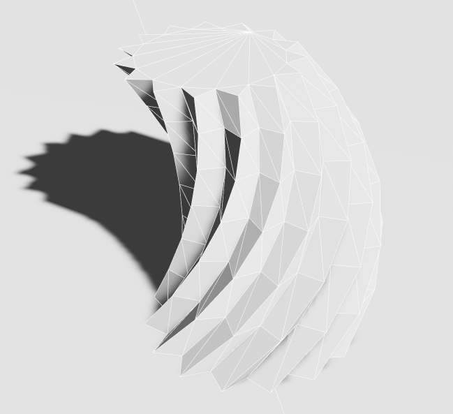
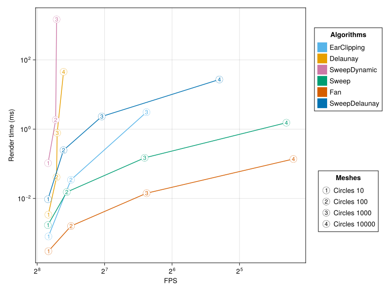

# Procedural Modelling

[](https://docs.rs/procedural_modelling)
[](https://crates.io/crates/procedural_modelling)
[](https://crates.io/crates/procedural_modelling)
[](https://bevyengine.org/learn/quick-start/plugin-development/#licensing)
[](https://github.com/bevy-procedural/modelling/actions)
[](https://github.com/bevy-procedural/modelling)

A Framework-Agnostic Procedural Modelling Library.

Uses a data structure based on half-edge meshes to represent (open) manifold meshes with optional non-manifold vertices. Our goal is to implement operations like Boolean Operations, Subdivisions, Curved Surfaces, and Stitching. The library aims to support the triangulation of 2d surfaces in a modular way that can be used without any of the 3d features.

Goal of this project is to provide a reusable and framework-agnostic implementation of procedural modelling and geometry algorithms. Flexibility is generally preferred over performance, though, often a good balance can be achieved.

## WARNING

This crate is still in a _very_ early stage of development. Expect frequent API modifications, bugs, and missing features. Feel free to contribute by opening issues, pull requests or sharing your ideas in [GitHub Discussion](https://github.com/bevy-procedural/modelling/discussions).

## Usage



Install using `cargo add procedural_modelling`. Generate the above mesh using the following code for rendering with bevy:

```rs
let mut mesh = BevyMesh3d::new();
let mut edge = mesh.insert_regular_star(1.0, 0.8, 30);
mesh.flip_yz().translate(&Vec3::new(0.0, -0.99, 0.0));
let trans = Transform::from_rotation(Quat::from_rotation_y(0.3))
    .with_translation(Vec3::new(-0.2, 0.3, -0.3));
edge = mesh.extrude_tri(edge, trans);
for _ in 0..5 {
    edge = mesh.extrude_tri_face(mesh.edge(edge).face_id(), trans);
}
mesh.to_bevy(RenderAssetUsages::default())
```

## Examples

<!-- Try the live examples!
 TODO: bevy-procedural.org -->

-   [box](https://github.com/bevy-procedural/modelling/blob/main/examples/box.rs) demonstrates different methods to build a cube from scratch. This is a good place to get started with this crate!
-   [fps_bench](https://github.com/bevy-procedural/modelling/blob/main/examples/fps_bench.rs) benchmarks the rendering performance of the different triangulation algorithms.

Or run the [examples](https://github.com/bevy-procedural/modelling/tree/main/examples) on your computer like, e.g., `cargo run --features="example_deps" --profile fast-dev --example box`.

For package development, we recommend using the `playground_bevy`- resp. `playground_wgpu`-subcrate. This example has a little [egui](https://github.com/jakobhellermann/bevy-inspector-egui/)-editor. Run it using `cargo watch -w playground -w src -x "run -p playground_bevy --profile fast-dev"`. The `fast-dev` profile will enable optimizations for the dependencies, but not for the package itself. This will slow down the first build _significantly_, but incremental builds are slightly faster and bevy's performance (bevy is used as the renderer in the examples) improves a lot.

When developing tests, we recommend `cargo watch -w src -x "test --profile fast-dev"` resp. `cargo llvm-cov --html` to generate a coverage report.

## Tutorial

We are currently working on some tutorials for the most important features.

-   [Getting started](https://docs.rs/procedural_modelling/latest/procedural_modelling/)

## Feature Progress

-   Attributes

    -   [x] Positions
    -   [x] Normals (flat, smooth)
    -   [x] Custom Attributes
    -   [ ] Crease Weights, Surface Groups
    -   [ ] Tangents
    -   [ ] UV Coordinates

-   Mesh Types

    -   [x] Open PL 2-Manifold in 2d and 3d Space
    -   [x] Bezier Curves for 2d Meshes
    -   [ ] Self-intersecting surfaces
    -   [ ] Open PL 2-Manifold in nd Space
    -   [ ] Open PL $n$-Manifold in md Space <!-- e.g., https://youtu.be/piJkuavhV50?si=1IZdm1PYnA2dvdAL&t=1135 -->
    -   [ ] Pseudomanifold (with singularities)
    -   [ ] Non-Manifold (with branching surfaces)
    -   [ ] Non-Euclidean
    -   [ ] Arbitrary Graphs
    -   [ ] NURBS, T-Splines <!-- Bezier Surfaces, Parametric Surfaces, Spline Networks...? -->

-   Triangulation

    -   [x] Fan
    -   [x] Ear Clipping
    -   [x] Montone Sweep-Line
    -   [x] Constrained Delaunay (using [Spade](https://github.com/Stoeoef/spade))
    -   [ ] Constrained Delaunay (using Monotone Sweep-Line)
    -   [x] Min-Weight Triangulation (using Dynamic Programming)
    -   [ ] Min-Weight Heuristic in $\mathcal{O}(n \log n)$
    -   [ ] Steiner Points

-   Primitives

    -   [x] 2d stuff: Polygon, Star, Circle, Loop, ...
    -   [x] Prismatoids: Prism, Antiprism, Cuboid, Pyramid, Frustum, ...
    -   [x] Platonic solids: Tetrahedron, Cube, Octahedron, Dodecahedron, Icosahedron
    -   [x] Round things: Cylinder, Cone, UV Sphere, Icosphere, Geodesic Polyhedra
    -   [ ] 4d stuff: Tesseract, Hypersphere, Hypersimplex, ...
    -   [ ] Cube Sphere
    -   [ ] Torus, Clifford Torus

-   Operations

    -   [x] Extrude
    -   [x] Linear Loft (Triangle, Polygon), [ ] Loft along path
    -   [x] Transform (Translate, Rotate, Scale, [ ] Shear)
    -   [x] Frequency Subdivision (partial)
    -   [ ] Chamfer, Cantellate, Bevel, Truncate, Bitruncate, Omnitruncate
    -   [ ] Boolean Operations (Union, Intersection, Difference, Symmetric Difference)
    -   [ ] (Anisotropic) Simplification, LODs
    -   [ ] Dualize
    <!--
    -   [ ] Taper
    -   [ ] Stitch
    -   [ ] Subdivide
    -   [ ] Snub
    -   [ ] Inset
    -   [ ] Stellate
    -   [ ] Plane Intersection
    -   [ ] Morph
    -   [ ] Voxelate
    -   [ ] Smooth
    -   [ ] Bridge
    -   [ ] Reflect
    -   [ ] Weld
    -   [ ] Twist
    -   [ ] Offset
    -   [ ] Inflate, Deflate
    -   [ ] Convex Hull
    -   [ ] Collapse
    -   [ ] Split
    -   [ ] Lattice
    -   [ ] Refine
    -   [ ] Crease
    -   [ ] Fractalize
    -   [ ] Project
            -->

-   Tools

    -   [x] Basic Network Science Tools (Laplacian, Adjacency, Degree, Spectrum)
    -   [x] Mesh Isomorphism (partial)
    -   [ ] 2d Polygons: Area, Efficient Valid Diagonals, Convexity, ...
    -   [ ] Geodesic Pathfinding
    -   [ ] Raycasting
    -   [ ] Topology Analysis
    -   [ ] Spatial Data Structures

<!--
-   Debug Visualizations

    -   [x] Indices
    -   [ ] Normals
    -   [ ] Tangents
    -   [ ] Topology
-->

-   Extensions

    -   [x] bevy
    -   [x] wgpu
    -   [x] nalgebra (when not using bevy)
    -   [x] SVG import/ [ ] export
    -   [ ] STL import/export
    -   [ ] OBJ import/export

## Customization via Traits

The availability of algorithms and operations for different mesh data structures is represented by traits. Some examples:

-   The `Transformable` trait indicates that you can apply affine transformation to a mesh and implements methods such as `translate` and `rotate`.
-   The `EuclideanMeshType` indicates that the mesh has vertex positions and lives in an Euclidean space and associates the mesh data type with a `Scalar` and `Vector` type etc.
-   The `MakePrismatoid` trait implements methods such as `insert_pyramid` or `insert_cube`.
-   The `MeshTypeHalfEdge` trait indicates that the mesh is based on a half-edge data structure (or can be treated as if) and makes sure that the mesh uses edge implementations that implement half-edge related methods like `twin_id`. It also enables the use of many algorithms that are currently only implemented for half-edge meshes.

For a full list of traits see the [documentation](https://docs.rs/procedural_modelling).

When using this trait-based library, you need to define your own type of `Mesh` and implement all traits you need. For most traits all methods have reasonable default implementations. This allows you to quickly implement meshes backed by a custom data structure or using custom vertex, face, edge, or mesh payloads. If you don't need anything special, you can use one of our default implementations such as `Bevy3dMesh` or the generic backend-agnostic `MeshNd<d>`. See `backends/bevy/mesh3d.rs` or `backends/nalgebra/mesh_nd.rs` for the exemplary default implementations.

## Features

The following cargo features are available:

-   `bevy` -- Compiles with support for bevy.
-   `wgpu` -- Compiles with support for wgpu.
-   `example_deps` -- Compiles with the dependencies necessary for the examples.
-   `netsci` -- Enable network science tools.
-   `svg` -- Enable SVG import. Adds [usvg](https://github.com/linebender/resvg) as a dependency.
-   `fonts` -- Enable font rendering. Adds [ab_glyph](https://github.com/alexheretic/ab-glyph) as a dependency.
-   `meshopt` -- Enable mesh optimization. Adds [meshopt](https://github.com/gwihlidal/meshopt-rs) as a dependency.
-   `nalgebra` -- Enable [nalgebra](https://nalgebra.org/) as a backend. This is usually required for anything but bevy.

For development only:

-   `sweep_debug` -- Collect debug information during the sweepline triangulation and enable visualizations in the bevy backend.
-   `sweep_debug_print` -- Print debug information for the sweepline triangulation.
-   `bevy_dynamic` -- Use dynamic linking for bevy. This is useful for faster incremental builds.

## Triangulation algorithms

The package supports different triangulation algorithms. The robustness and rendering speed of the produced triangulations varies significantly. These performance differences usually only matter for meshes with extremely large flat surfaces. In the table below, we compare the performance of the different algorithms for a circle with 100, 1000, and 10000 vertices. The "ZigZag" mesh has 1000 reps. 10000 vertices and is designed to demonstrate the worst-case for the Sweep algorithm.

-   **Fan** Extremely fast, but only works for convex polygons and results are often numerically unstable. Runs in $\mathcal{O}(n)$ time.
-   **EarClipping** Simple but slow and numerically unstable textbook-algorithm for reference. Runs in $\mathcal{O}(n^2)$ time. When the input provokes near-degenerate triangles, e.g., a very large circle, the algorithm switches to recovery mode, taking up to $\mathcal{O}(n^3)$ time.
-   **Sweep** Very fast sweep-line algorithm that might produce triangulations with unnecessarily long edges. Works for arbitrary polygons. Runs in $\mathcal{O}(n \log n)$ time. See [CMSC 754](https://www.cs.umd.edu/class/spring2020/cmsc754/Lects/lect05-triangulate.pdf).
-   **Delaunay** Fast and numerically stable triangulation. Currently uses [Spade](https://github.com/Stoeoef/spade). Runs in $\mathcal{O}(n \log n)$ time.
-   **EdgeFlip** Same output as Delaunay, but without external dependencies and using a very slow edge-flipping algorithm. Runs in $\mathcal{O}(n^3)$ time.
    EdgeFlip,
-   **SweepDynamic** Applies the MinWeight algorithm to each monotone sub-polygon.
-   **MinWeight** Calculates the minimum weight triangulation, i.e., minimizes the overall edge length of the triangulation. Very slow, but produces the theoretically fastest rendering triangulations for large flat surfaces. Runs in $\mathcal{O}(n^3)$ time using dynamic programming. (Since we don't have inner points this is not NP-hard)
-   **Heuristic** Heuristic algorithm that tries to find a compromise between the speed of `Sweep` and the quality of `MinWeight`.
-   **Auto** (default) Automatically choose the "best" algorithm based on the input. The edge-weight will be the same as Delaunay or better. Uses specialized fast implementations for small polygons to quickly generate min-weight triangulations. Falls back to Delaunay for larger polygons.



-   Time for the triangulation on a Intel i7-12700K (single threaded). Run the benchmarks using `cargo bench --features benchmarks --profile release`.
-   FPS when rendering 100 large, transparent instances with the bevy 0.14.2 pbr shader on a Nvidia GeForce RTX 4060 Ti in Full HD. See `cargo run -p fps_bench --profile release` and `julia --project=./playground/fps_bench/FPSBench ./playground/fps_bench/FPSBench/src/main.jl`. For the non-Delaunay algorithms, the rendering time deteriorates for the larger circles since the edge length is not minimized causing significant overdraw.

## Supported Bevy Versions

The following table shows the compatibility of `procedural_modelling` (when using the `bevy` feature) with certain versions of Bevy:

| bevy | bevy_procedural_meshes |
| ---- | ---------------------- |
| 0.17 | 0.4.\*, main, next     |
| 0.15 | 0.3.\*                 |
| 0.14 | 0.2.\*                 |
| 0.13 | 0.1.\*                 |

## License

Except where noted (below and/or in individual files), all code in this repository is dual-licensed, allowing you the flexibility to choose between:

-   The MIT License (LICENSE-MIT or http://opensource.org/licenses/MIT)
-   The Apache License, Version 2.0 (LICENSE-APACHE or http://www.apache.org/licenses/LICENSE-2.0).

## Contribution

Unless you explicitly state otherwise, any contribution intentionally submitted for inclusion in the work by you, as defined in the Apache-2.0 license, shall be dual licensed as above, without any additional terms or conditions.

## How to Contribute

We welcome contributions from the community! Here are some ways you can help:

1.  **Report Bugs:**

    -   If you find a bug, please open an issue on GitHub with detailed information on how to reproduce it.

2.  **Suggest Features:**

    -   Have an idea for a new feature? Open an issue to discuss it. We appreciate feedback and suggestions.

3.  **Submit Pull Requests:**

    -   Fork the repository and create a new branch for your feature or bug fix.
    -   Assign an issue to yourself or open a new issue to work on.
    -   Make your changes, ensuring that your code adheres to the project's coding standards.
    -   Write tests for your changes, if applicable.
    -   Submit a pull request with a clear description of your changes and the problem they solve.

4.  **Improve Documentation:**
    -   Help us improve our documentation by fixing typos, clarifying instructions, or adding new sections.
